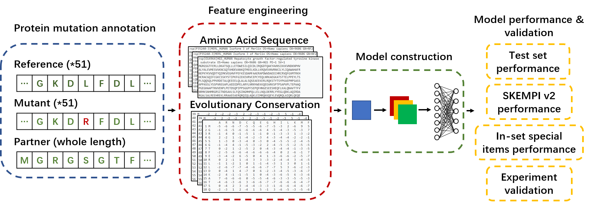

# Mutation Impact on Protein-Protein Interaction (MIPPI)

a deep transformer based neural network to predict mutation impact on protein-protein interaction.

    

* mippi_pkg -> Mutation Impact on Protein-Protein Interaction **standalone package tool**
* mippi -> **source code** of preprocessing and training

## Requirements
* python 3.7+
* tensorflow 2.0+
* numpy, pandas
